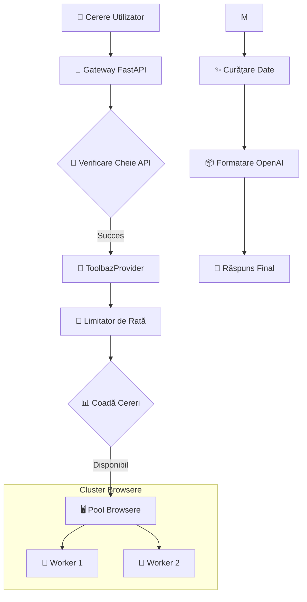

# 🚀 Toolbaz-2API Docker: Redă viață paginilor web vechi prin API-uri moderne


---

## 🌟 Navigare
- [📖 Prefață: De ce avem nevoie de asta?](#-prefață-de-ce-avem-nevoie-de-asta)
- [🏗️ Arhitectura Proiectului](#-arhitectura-proiectului)
- [🛠️ Principii Tehnice](#-principii-tehnice)
- [⚡ Pornire Rapidă](#-pornire-rapidă)
- [🎮 Instrucțiuni de Utilizare](#-instrucțiuni-de-utilizare)
- [⚖️ Avantaje și Dezavantaje](#-avantaje-și-dezavantaje)
- [🔮 Viitor și Roadmap](#-viitor-și-roadmap)
- [📝 Întrebări Frecvente](#-întrebări-frecvente)
- [📜 Licență](#-licență)

---

## 📖 Prefață: De ce avem nevoie de asta?

> 💭 **Reflecție**: În era AI, cum vedem "dreptul de acces la informație"?

Multe instrumente AI excelente rămân blocate în interfețe Web, în timp ce dezvoltatorii moderni preferă API-urile. **Toolbaz-2API** deschide această ușă, transformând interacțiunea manuală în automatizare eficientă.

---

## 🏗️ Arhitectura Proiectului



---

## ⚡ Pornire Rapidă

### **Varianta A: Docker Compose 🐳 (Recomandat)**

```bash
# 1. Clonează depozitul
git clone https://github.com/lza6/toolbaz-2api-docker.git
cd toolbaz-2api-docker

# 2. Configurare mediu
cp .env.example .env

# 3. Pornire
docker-compose up -d --build
```

---

## 🎮 Instrucțiuni de Utilizare

### 🖥️ Consola Web
Accesează `http://localhost:8000` pentru a testa API-ul direct într-o interfață modernă.

### 🔌 Exemplu CURL
```bash
curl -X POST http://localhost:8000/v1/chat/completions \
  -H "Authorization: Bearer 1" \
  -d '{
    "model": "toolbaz-v4.5-fast",
    "messages": [{"role": "user", "content": "Salut!"}],
    "stream": true
  }'
```

---

## ⚖️ Avantaje și Dezavantaje

| Dimensiune | Scorul | Explicație |
|------|------|----------|
| **🚀 Simplitate** | ⭐⭐⭐⭐⭐ | Docker, gata de utilizare în 5 minute |
| **🛡️ Stabilitate** | ⭐⭐⭐⭐ | Mecanisme de retry și monitorizare |
| **⚡ Viteză** | ⭐⭐ | Limitat de timpul de încărcare al paginii (3-8s) |

---

## 📜 Licență
Acest proiect este sub licența **Apache License 2.0**.